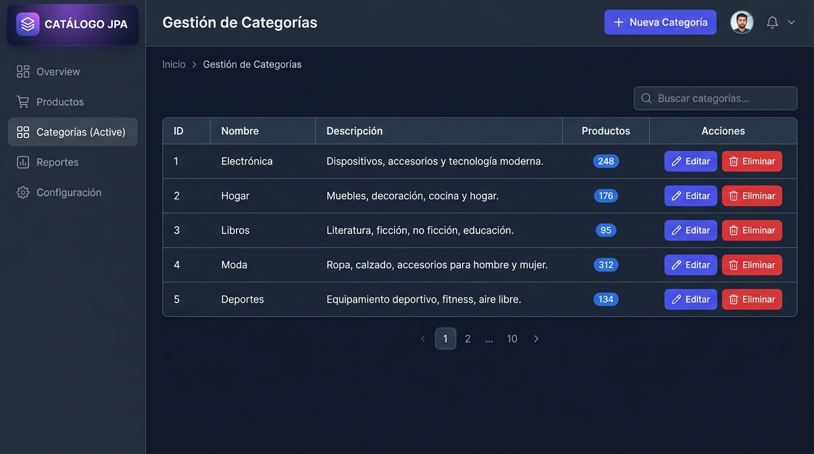
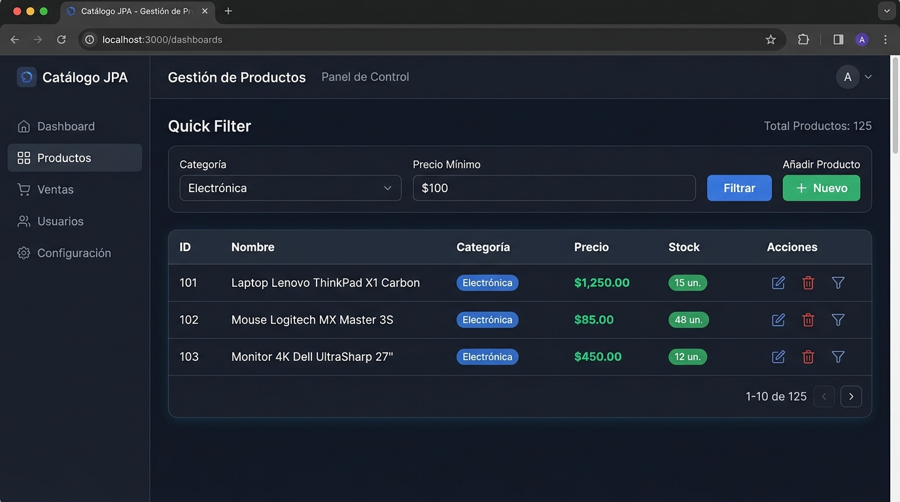
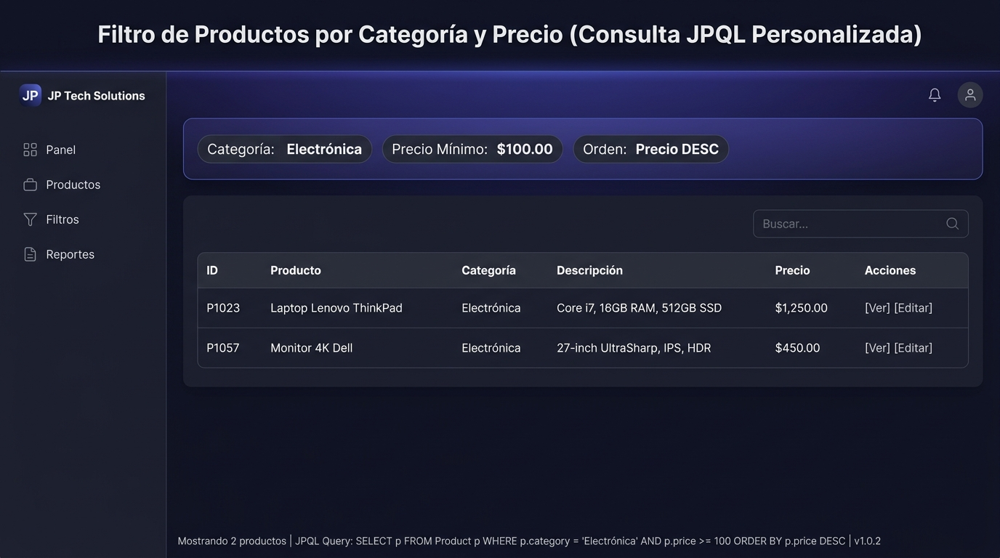

# Post-contenido — Unidad 8: Persistencia con JPA/Hibernate (Catálogo de Categorías y Productos)

**Estudiante:** Dallos  
**Materia:** Desarrollo Web & Persistencia de Datos  
**Tecnologías:** Java 17, Spring Boot 3.2, Spring Data JPA, Hibernate, MySQL 8, Thymeleaf, Bean Validation (Jakarta Validation)  
**Submódulo:** `catalogo-jpa/`  

---

## 1. Descripción del Proyecto

Este proyecto implementa un sistema web robusto y desacoplado para la administración de un **Catálogo de Categorías y Productos**, fundamentado en la especificación **Jakarta Persistence API (JPA)**, el framework **Hibernate** y la abstracción **Spring Data JPA**.

El desarrollo abarca dos fases técnicas clave:
- **Parte 1 (CRUD Categoría):** Mapeo objeto-relacional de la entidad `Categoria`, repositorios con métodos derivados, reglas de negocio con validación de unicidad de nombre (`case-insensitive`), control de integridad referencial antes de la eliminación y formularios dinámicos con Thymeleaf y Bean Validation.
- **Parte 2 (Relación Bidireccional y Consultas JPQL):** Mapeo de la relación `@ManyToOne` / `@OneToMany` con estrategia de carga perezosa (`FetchType.LAZY`), mitigación del problema de consultas $N+1$ mediante `JOIN FETCH`, y diseño de una consulta personalizada JPQL para filtrar productos por categoría con precio superior a un umbral ordenados descendentemente.

---

## 2. Diagrama de Relación y Modelo Entidad-Relación

```text
+-----------------------------------+               +-----------------------------------+
|          CATEGORIAS (1)           | 1           * |           PRODUCTOS (N)           |
+-----------------------------------+ <------------ +-----------------------------------+
| PK  id           : BIGINT (AI)    |   mappedBy    | PK  id           : BIGINT (AI)    |
| UK  nombre       : VARCHAR(80)    |   (LAZY)      |     nombre       : VARCHAR(120)   |
|     descripcion  : VARCHAR(250)   |               |     precio       : DECIMAL(10,2)  |
|                                   |               |     stock        : INT            |
|                                   |               | FK  categoria_id : BIGINT (NOT NULL) |
+-----------------------------------+               +-----------------------------------+
```

### Relación Bidireccional Mapeada en JPA:
- **Lado Propietario (`Producto`):**
  ```java
  @ManyToOne(fetch = FetchType.LAZY)
  @JoinColumn(name = "categoria_id", nullable = false)
  private Categoria categoria;
  ```
- **Lado Inverso (`Categoria`):**
  ```java
  @OneToMany(mappedBy = "categoria", fetch = FetchType.LAZY)
  private List<Producto> productos = new ArrayList<>();
  ```

---

## 3. Configuración de Base de Datos MySQL 8

### Script SQL para Inicialización de Base de Datos y Credenciales

Ejecute el siguiente bloque de sentencias en su cliente de MySQL (`mysql -u root -p` o MySQL Workbench):

```sql
-- 1. Creación de la base de datos con juego de caracteres UTF-8
CREATE DATABASE IF NOT EXISTS catalogo_db 
  CHARACTER SET utf8mb4 
  COLLATE utf8mb4_unicode_ci;

-- 2. Creación del usuario de aplicación
CREATE USER IF NOT EXISTS 'appuser'@'localhost' IDENTIFIED BY 'apppass';
CREATE USER IF NOT EXISTS 'appuser'@'%' IDENTIFIED BY 'apppass';

-- 3. Asignación de todos los privilegios sobre catalogo_db
GRANT ALL PRIVILEGES ON catalogo_db.* TO 'appuser'@'localhost';
GRANT ALL PRIVILEGES ON catalogo_db.* TO 'appuser'@'%';

-- 4. Aplicar cambios
FLUSH PRIVILEGES;
```

### Archivo `catalogo-jpa/src/main/resources/application.properties`

```properties
spring.datasource.url=jdbc:mysql://localhost:3306/catalogo_db?useSSL=false&serverTimezone=UTC&allowPublicKeyRetrieval=true
spring.datasource.username=appuser
spring.datasource.password=apppass
spring.datasource.driver-class-name=com.mysql.cj.jdbc.Driver

spring.jpa.hibernate.ddl-auto=update
spring.jpa.show-sql=true
spring.jpa.properties.hibernate.format_sql=true
spring.jpa.database-platform=org.hibernate.dialect.MySQLDialect

server.port=8080
```

---

## 4. Decisiones de Diseño y Buenas Prácticas

### 4.1 Estrategia de Carga Perezosa (`FetchType.LAZY`)
Por defecto, JPA define `@ManyToOne` con `FetchType.EAGER`, lo cual puede provocar consultas inmediatas e innecesarias que saturan el pool de conexiones y consumen memoria de forma desmedida. En este proyecto:
- Ambas asociaciones (`@ManyToOne` y `@OneToMany`) se configuraron **explícitamente como `FetchType.LAZY`**.
- La carga de entidades asociadas se efectúa bajo demanda o mediante proyecciones optimizadas en JPQL.

### 4.2 Mitigación del Problema de Consultas $N+1$ con `JOIN FETCH`
Para evitar el escenario donde listar $N$ productos genera $1$ consulta inicial para los productos y $N$ consultas adicionales para obtener cada categoría asociada, se definió la consulta optimizada en `ProductoRepository`:
```java
@Query("SELECT p FROM Producto p JOIN FETCH p.categoria")
List<Producto> findAllConCategoria();
```
Esto le indica a Hibernate que resuelva la asociación en una única sentencia SQL con `INNER JOIN`, reduciendo la latencia de red y garantizando máximo rendimiento.

### 4.3 Consulta Personalizada JPQL Filtrada
Para satisfacer los requisitos de búsqueda dinámica de productos con precios superiores a un valor dentro de una categoría dada:
```java
@Query("SELECT p FROM Producto p JOIN FETCH p.categoria c " +
       "WHERE c.id = :categoriaId AND p.precio > :precioMinimo " +
       "ORDER BY p.precio DESC")
List<Producto> buscarPorCategoriaConPrecioMayorA(
    @Param("categoriaId") Long categoriaId,
    @Param("precioMinimo") BigDecimal precioMinimo);
```

### 4.4 Validación Multinivel e Integridad de Datos
1. **Capa Modelo (Bean Validation / Jakarta):** `@NotBlank`, `@Size(min=2, max=80)`, `@NotNull`, `@Positive`, `@Min(0)`.
2. **Capa de Servicios:** Validación de unicidad de nombre de categoría insensible a mayúsculas/minúsculas (`findByNombreIgnoreCase`) y bloqueo transaccional de eliminación si una categoría posee productos asociados.
3. **Capa Base de Datos:** Restricciones DDL (`unique = true`, `nullable = false`, claves foráneas).

### 4.5 Transaccionalidad (`@Transactional`)
- Las operaciones de mutación (`guardar`, `eliminar`) están anotadas con `@Transactional` para garantizar propiedades ACID (atomicidad y consistencia).
- Las consultas de solo lectura usan `@Transactional(readOnly = true)`, optimizando la gestión del contexto de persistencia al desactivar el dirty-checking innecesario de Hibernate.

---

## 5. Tabla de Endpoints y Mapeo de Controladores

| Módulo | Método HTTP | Ruta | Descripción |
| :--- | :---: | :--- | :--- |
| **Inicio** | `GET` | `/` | Redirecciona automáticamente a `/categorias` |
| **Categorías** | `GET` | `/categorias` | Lista todas las categorías registradas |
| **Categorías** | `GET` | `/categorias/nuevo` | Despliega el formulario para crear nueva categoría |
| **Categorías** | `POST` | `/categorias/guardar` | Procesa y valida el alta/edición de una categoría |
| **Categorías** | `GET` | `/categorias/editar/{id}` | Carga el formulario con los datos de la categoría para edición |
| **Categorías** | `GET` | `/categorias/eliminar/{id}` | Vista de confirmación con detalle y conteo de productos |
| **Categorías** | `POST` | `/categorias/eliminar/{id}` | Ejecuta la eliminación validando integridad referencial |
| **Productos** | `GET` | `/productos` | Lista todos los productos con JOIN FETCH de categoría |
| **Productos** | `GET` | `/productos/nuevo` | Formulario de producto con selector de categorías |
| **Productos** | `POST` | `/productos/guardar` | Valida y persiste producto vinculando la clave foránea |
| **Productos** | `GET` | `/productos/editar/{id}` | Formulario de edición con selección de categoría actual |
| **Productos** | `GET` | `/productos/eliminar/{id}` | Elimina el producto por su identificador |
| **Productos** | `GET` | `/productos/categoria/{categoriaId}/precio-mayor?minimo=X` | **Consulta JPQL:** Filtra productos por categoría con precio $> X$ (DESC) |

---

## 6. Instrucciones de Ejecución

### Prerrequisitos
- JDK 17 o superior instalado y configurado en el `PATH`.
- Apache Maven 3.8+.
- Servidor MySQL 8.0 en ejecución en el puerto 3306.

### Pasos para Ejecutar el Proyecto
1. Clonar o posicionarse en el directorio del proyecto:
   ```bash
   cd dallos-post1-u8/catalogo-jpa
   ```
2. Asegurarse de que la base de datos `catalogo_db` y el usuario `appuser` existan en MySQL (ver Sección 3).
3. Compilar y ejecutar con el plugin de Spring Boot:
   ```bash
   mvn clean spring-boot:run
   ```
4. Acceder en el navegador web a la dirección:
   ```text
   http://localhost:8080/categorias
   ```
5. Para ejecutar la suite de pruebas unitarias y de integración:
   ```bash
   mvn test
   ```

---

## 7. Evidencias Visuales y Capturas de Pantalla

### 7.1 Gestión de Categorías (Listado y CRUD)


### 7.2 Gestión de Productos con Carga de Categoría


### 7.3 Consulta JPQL Personalizada (Filtro por Categoría y Precio Descendente)


---

## 8. Historial de Commits del Proyecto

El desarrollo se realizó de manera progresiva y modular cumpliendo con la política de commits descriptivos:

1. `feat: configuracion inicial de Spring Boot 3.2, conexion MySQL 8 y clase principal CatalogoApplication`
2. `feat(part1): implementar entidad Categoria, CategoriaRepository y CategoriaService con reglas de negocio`
3. `feat(part1): implementar CategoriaController y vistas Thymeleaf para CRUD de categorias`
4. `feat(part2): implementar ProductoRepository con consultas JPQL (JOIN FETCH y filtro personalizado) y ProductoService`
5. `feat(part2): implementar ProductoController y vistas Thymeleaf de productos con soporte para consulta JPQL personalizada`
6. `test: anadir pruebas unitarias para CategoriaService y ProductoService con JUnit 5 y Mockito`
7. `docs: documentacion tecnica completa en README.md y capturas de entrega`